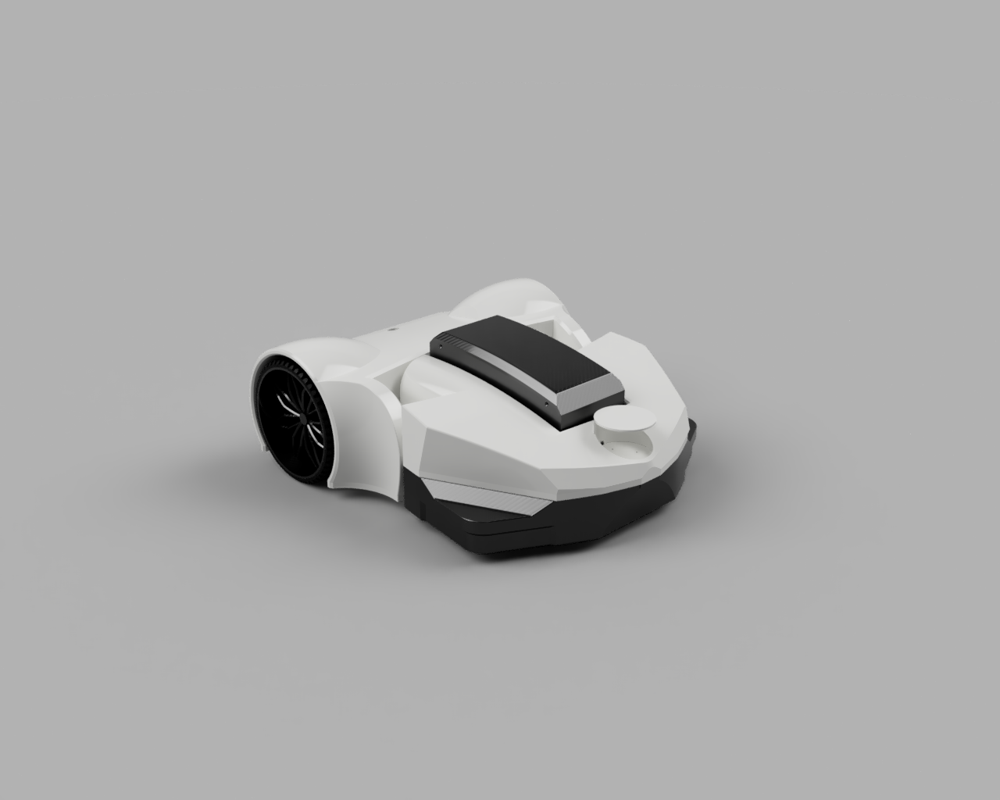

<h1 align="center">Grasshopper</h1>

## Description
Grasshopper is an autonomous lawn mowing robot.

The design is based on the idea of the Arctic X concept
(https://www.thingiverse.com/thing:3273187) of Robin Fröjd (https://twitter.com/r_frojd)

The robot is split in two sections, the mower and the drive section
connected by a coupler to allow the mower section to rotate to a maximum of
15 degrees around the rotational axis of the robot to adopt to the changing
terrain in front. The drive section houses the motors, most of the electronics
and sensors of the robot and connects through the coupler to the mower section
where the battery box, mower motor and lidar sensor
(https://www.robotshop.com/en/ydlidar-g2-360-laser-scanner.html) are located.

Because of the long print times of each wheel there is also an axel for a wheel
which can be found on Amazon (https://www.amazon.de/Greenstar-Kunststoff-Kugellager-Honda-RTH2808/dp/B00TNB597Q)
The ball bearing of the wheel needs to be removed to connect to the axel.

## License
CREATIVE COMMONS ATTRIBUTION SHARE ALIKE 4.0 INTERNATIONAL

See `LICENSE` for more information.

## Contributing
Bug reports and pull requests are welcome on GitHub at
https://github.com/sarnold04/Grasshopper
